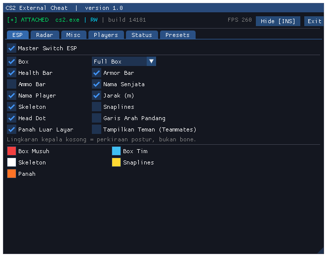
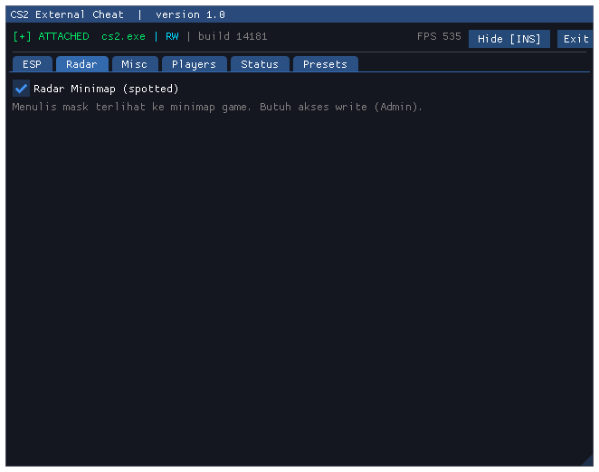
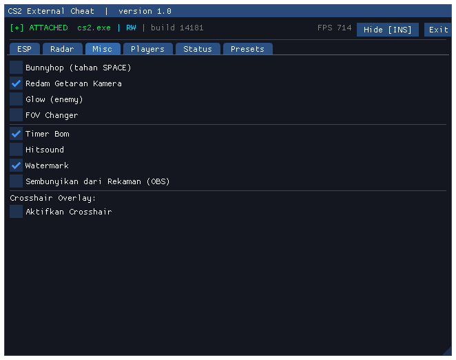
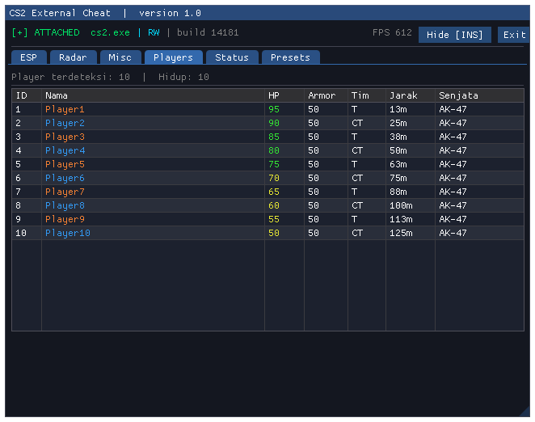
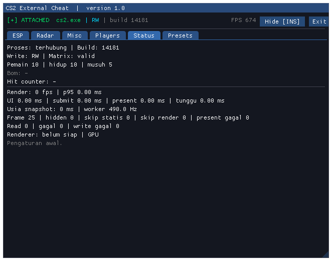
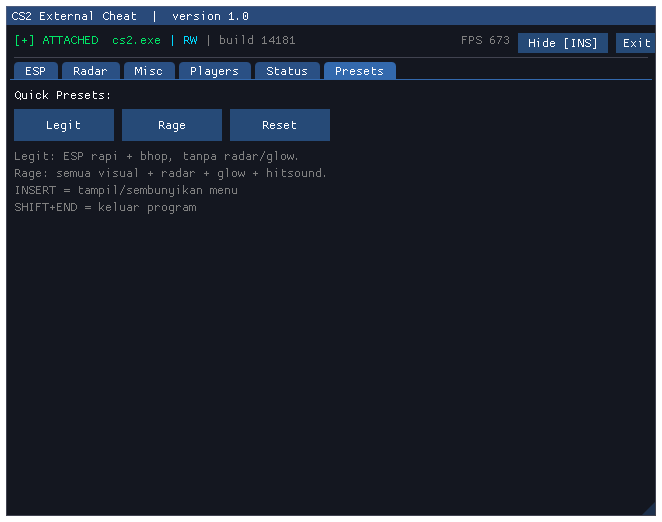

# Cs2Hack Free

Cheat **external** Counter-Strike 2 dengan overlay DirectX 11 + ImGui. Tanpa inject DLL — membaca memori `cs2.exe` dan menggambar ESP lewat window overlay transparan. Target build game **14181**.

## Tampilan Menu

| ESP | Radar |
|---|---|
|  |  |

| Misc | Players |
|---|---|
|  |  |

| Status | Presets |
|---|---|
|  |  |

## Fitur

### ESP (`ESP`)

| Fitur | Keterangan |
|---|---|
| Master Switch | Hidup/mati semua ESP sekaligus |
| Box | Full Box / Corner Box |
| Health Bar | Bar HP di sisi box |
| Armor Bar | Bar armor |
| Ammo Bar | Sisa peluru + kapasitas |
| Nama Senjata | AK-47, AWP, M4A4, dst (40+ senjata dikenali) |
| Nama Player | Nama pemain |
| Jarak (m) | Jarak meter ke pemain |
| Skeleton | Tulang (auto-deteksi stride 32/48 byte) |
| Snaplines | Garis dari bawah layar ke pemain |
| Head Dot | Titik kepala (kosong = perkiraan postur, bukan bone) |
| Garis Arah Pandang | Arah bidik pemain (eye ray) |
| Panah Luar Layar | Panah arah musuh di luar layar |
| Teammates | Tampilkan teman setim atau tidak |
| 5 Color Picker | Warna Box Musuh, Box Tim, Skeleton, Snaplines, Panah |

### Radar (`Radar`)

Radar Minimap (spotted) — musuh muncul di minimap game. Butuh akses tulis (jalankan sebagai Admin).

### Misc (`Misc`)

| Fitur | Keterangan |
|---|---|
| Bunnyhop | Auto-jump saat tahan `SPACE` (edge-trigger, anti double-jump) |
| Redam Getaran Kamera | Menghapus view punch (no shake) |
| Glow (enemy) | Glow musuh mengikuti warna Box Musuh, restore otomatis |
| FOV Changer | Slider 60–130, nonaktif otomatis saat scope |
| Timer Bom | Countdown C4 + status defuse + nama defuser (validasi signature + GlobalVars) |
| Hitsound | Beep saat hit (900 Hz) / kill (300 Hz), non-blocking |
| Watermark | Info CS2 \| RW \| fps di pojok layar |
| OBS Bypass | Overlay disembunyikan dari rekaman (`WDA_EXCLUDEFROMCAPTURE`) |
| Crosshair Overlay | Size, gap, thickness + warna custom |

### Players (`Players`)

Tabel live semua pemain: ID, Nama (warna T/CT), HP (hijau/kuning/merah), Armor, Tim, Jarak, Senjata. Baris hijau = hidup terlihat, merah = mati.

### Status (`Status`)

Diagnostik live: status attach, build game (+peringatan `STALE` jika offset kedaluwarsa), mode tulis RW/READ-ONLY, validitas view matrix, jumlah pemain/musuh, status bom, hit counter, fps render + p95, latensi UI/submit/present, usia snapshot, frekuensi worker, statistik RPM, renderer GPU/WARP. Log yang sama ditulis tiap 2 detik ke `cs2_diag.txt`.

### Presets (`Presets`)

- **Legit** — ESP rapi + bhop, tanpa radar/glow.
- **Rage** — semua visual + radar + glow + hitsound.
- **Reset** — kembali ke default.

## Kontrol

| Tombol | Aksi |
|---|---|
| `INSERT` | Tampil/sembunyikan menu |
| `SHIFT+END` | Keluar program |

Semua perubahan tersimpan otomatis ke `cs2cheat.cfg` (1 detik setelah diubah).

## Cara Pakai

1. Buka CS2, masuk match.
2. Jalankan `cs2_cheat.exe` **sebagai Administrator** (butuh Admin agar Radar/Glow/FOV bisa menulis memori; tanpa Admin hanya mode baca/ESP).
3. Tekan `INSERT` untuk membuka menu.

> Butuh update offsets (`cheat/offsets.h`) setiap update besar CS2 — tab Status menampilkan peringatan `STALE` jika build tidak cocok.

## Build dari Source

Butuh toolchain **Zig 0.13.0** (Clang 18 portable) di `zig-windows-x86_64-0.13.0/` — unduh dari [ziglang.org](https://ziglang.org/download/) jika folder belum ada.

```powershell
.\build.ps1          # Release
.\build.ps1 debug    # Debug
.\build.ps1 clean    # Hapus exe
```

Alternatif via CMake (Windows only). Output: `cs2_cheat.exe` (manifest `requireAdministrator` otomatis disertakan).

## Struktur

```
cheat/          main.cpp (worker+render loop) · overlay.cpp/h (DX11+ImGui)
                features.h (ESP/radar/bhop/glow/fov/bom/hitsound/config)
                memory.h · offsets.h (build 14181)
math/           vec2 · vec3 · mat3x4 · mat4x4
third_party/    imgui (bundled)
docs/           screenshot menu (background hitam dibersihkan)
```
